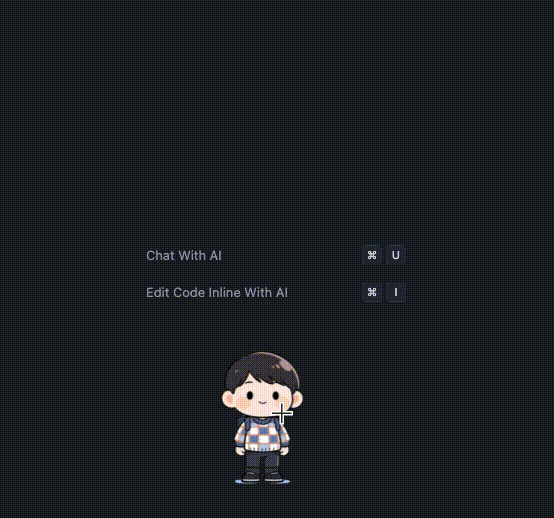

<div align="center">
  
  <h1>CodeWalkers</h1>
  <p><strong>A Desktop Virtual Companion powered by Tauri + React + Rust</strong></p>

  

  <p>
    <a href="./README_zh.md">中文</a> | <span>English</span>
  </p>

  [](https://github.com/you-want/CodeWalkers/actions/workflows/ci.yml)
  [](https://opensource.org/licenses/MIT)
  [](https://tauri.app/)
  [](https://react.dev/)
</div>

---

## 📖 Introduction

**CodeWalkers** is a cross-platform desktop virtual companion assistant. It freely wanders at the bottom of your screen (above the Dock/Taskbar) and is always ready to interact with you via its built-in terminal.

Powered by the robust **Tauri v2** architecture, it leverages **Rust** for high-performance, low-resource backend logic, and **React + TypeScript** for a beautiful, transparent frontend interface. It is a fully modernized, cross-platform reimagining and upgrade of the original `Lil Agents` concept.

### ✨ Key Features

- **🏃‍♂️ Desktop Virtual Companion**: Characters roam freely at the bottom of the screen with realistic walking animations and resting states.
- **🖱️ Pixel-Perfect Click-Through**: Utilizes high-precision Canvas Alpha detection. Clicking the character's solid body allows you to drag it, while clicks on the transparent areas around the character perfectly pierce through to your desktop or underlying applications.
- **🖥️ Immersive AI Terminal (PTY)**: Features a built-in real system terminal session based on `portable-pty`, seamlessly integrating the Gemini CLI. You can send messages directly within the app and receive real-time thinking bubbles and typewriter-style feedback.
- **🎵 Native Sound Feedback**: Crisp sound effects play when sending messages, receiving replies, or when a character finishes its patrol.
- **🎨 Multi-Character & Theme System**:
  - One-click character switching (Ethan / Luna).
  - Four different terminal theme styles: `Midnight` (Default), `Peach`, `Cloud`, `Moss`.
- **🚀 Extremely Low Resource Usage**: Thanks to the combination of Tauri and Rust, its memory footprint is minimal, making it significantly more lightweight than Electron alternatives.

---

## 🛠️ Getting Started

### Prerequisites

- [Node.js](https://nodejs.org/) (Version >= 22.0.0)
- [pnpm](https://pnpm.io/) (Version >= 10.0.0) - **This project strictly requires pnpm**
- [Rust](https://www.rust-lang.org/) (Latest stable version)

### Development

1. Clone the repository:
   ```bash
   git clone https://github.com/you-want/CodeWalkers.git
   cd CodeWalkers
   ```

2. Install dependencies:
   ```bash
   # You MUST use pnpm; npm or yarn will be blocked
   pnpm install
   ```

3. Environment Variables (Optional):
   If you need to use the built-in Gemini CLI assistant, create a `.env` file in the root directory and add your API Key:
   ```env
   GEMINI_API_KEY=your_api_key_here
   ```

4. Start the development server:
   ```bash
   pnpm tauri dev
   ```
   > On the first run, the Rust compiler will download and build dependencies, which may take a few minutes. Subsequent starts will be much faster.

### Build

If you want to package a standalone cross-platform application for distribution:

```bash
pnpm tauri build
```
The compiled binaries will be generated in the `src-tauri/target/release/bundle` directory (e.g., `.app` / `.dmg` for macOS, `.exe` for Windows).

---

## 🎮 User Operation Manual

### 1. Interacting with Characters
- **Drag & Drop**: Click and hold the character's solid body to drag them anywhere on your screen. They will resume walking from their new location.
- **Click-Through**: The transparent areas around the character are fully click-through. You can interact with your desktop or applications behind the character without any interference.

### 2. The AI Terminal (Session Panel)
- **Open/Close**: Simply click on the character to open its associated AI terminal panel. Click anywhere outside the panel to hide it.
- **Switch Providers**: At the top left of the terminal, use the dropdown to switch between supported AI CLI providers (e.g., Claude, Gemini, Copilot). If a provider is not installed, the app will prompt you to install it.
- **Chat & Commands**: 
  - Type your messages in the input box and press `Enter` to chat.
  - Type `/clear` to clear the current terminal history.
  - Click the **Copy** icon at the top right to copy the AI's last response.
  - Click the **Refresh** icon to restart the current terminal session.
- **Thinking Bubbles**: While the AI is processing your request, you'll see a real-time thinking bubble above the character's head, keeping you informed of its progress.

### 3. System Tray & Customization
- Look for the **CodeWalkers** icon in your system tray (menu bar/taskbar). Click it to access the menu:
  - **Characters**: Toggle the visibility of Ethan and Luna independently.
  - **Themes**: Switch between 4 terminal themes: Midnight, Peach, Cloud, and Moss.
  - **Size**: Adjust the character scale (Small / Medium / Large).
  - **Sound Effects**: Enable or disable interaction sounds.
  - **Quit**: Exit the application safely.

### 4. Custom Status & Reminders
- Right-click on any character to open the context menu.
- Click **"⚙️ 自定义状态设置..."** (Custom Status Settings) to open the configuration modal.
- Here you can define your current status (e.g., Working, Break, Lunch) with custom icons and messages.
- You can also set up interval or fixed-time reminders for each status, and the character will notify you via a speech bubble when the time comes!
- **Component Props & Usage:** The `StatusSettingsModal` is globally managed via Zustand (`useStatusSettingsStore`) and does not require props. To trigger it from anywhere:
  ```tsx
  import { useStatusSettingsStore } from '@/store/useStatusSettingsStore';
  // ...
  const openModal = () => useStatusSettingsStore.getState().open(currentConfig, handleSave);
  ```

---

## 📂 Structure

- `src/` - React frontend code (UI, IPC communication, drag logic, animation rendering, theme system)
- `src-tauri/` - Rust backend code (Window management, PTY terminal process mounting, transparency control, system tray)
- `public/` - Static assets (video animations `walk-ethan-01.mov`, sound files `sounds/`)
- `.github/workflows/` - CI/CD automation workflows

---

## 💖 Acknowledgments / Inspired By

This project was heavily inspired by the amazing [lil-agents](https://github.com/ryanstephen/lil-agents) created by [ryanstephen](https://github.com/ryanstephen). 
While `lil-agents` is a brilliant native macOS application, it is limited to the Apple ecosystem. As I was exploring the capabilities of Tauri, I decided to create **CodeWalkers** to bring this delightful "desktop companion + AI terminal" experience to a true cross-platform environment (Windows / Linux / macOS) using **Tauri v2 and Rust**. 

Huge thanks to the original creator for the wonderful idea!

---

## 📄 License

This project is licensed under the [MIT License](./LICENSE). You are free to use, modify, and distribute it.
