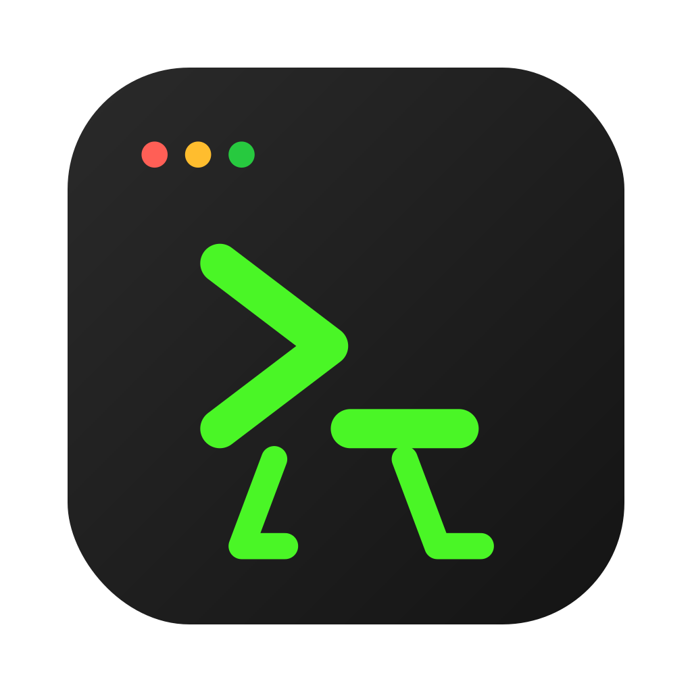

<div align="center">
  
  <h1>CodeWalkers</h1>
  <p><strong>A Desktop Virtual Companion powered by Tauri + React + Rust</strong></p>

  <p>
    <span>中文</span> | <a href="./README.md">English</a>
  </p>

  [](https://github.com/you-want/CodeWalkers/actions/workflows/ci.yml)
  [](https://opensource.org/licenses/MIT)
  [](https://tauri.app/)
  [](https://react.dev/)
</div>

---

## 📖 项目简介

**CodeWalkers** 是一个跨平台的桌面虚拟陪伴助手。它会在你的电脑屏幕下方（Dock 栏上）自由漫步，并随时准备通过内置的终端与你进行交互。

本项目基于强大的 **Tauri v2** 架构，使用 **Rust** 编写高性能、低资源占用的后端逻辑，使用 **React + TypeScript** 构建精美的透明前端界面。它是原版 `Lil Agents` 概念的全面现代化、跨平台复刻与升级版。

### ✨ 核心特性

- **🏃‍♂️ 桌面虚拟陪伴**：角色会在屏幕下方自由漫游，有真实的行走动画与休息状态。
- **🖱️ 像素级点击穿透**：采用高精度 Canvas Alpha 检测技术。点击角色实体时可以拖拽，点击角色旁边的透明区域时，鼠标事件会完美穿透到你的桌面或后面的软件。
- **🖥️ 沉浸式 AI 终端 (PTY)**：内置基于 `portable-pty` 的真实系统终端会话，完美集成 Gemini CLI，你可以直接在应用内发送消息，并得到实时的思考气泡和打字机反馈。
- **🎵 原生音效反馈**：发送消息、接收回复以及角色巡游到达终点时，都会有清脆的提示音。
- **🎨 多角色与主题系统**：
  - 支持一键切换角色（Ethan / Luna）。
  - 支持四种不同的终端主题风格：`Midnight` (默认)、`Peach`、`Cloud`、`Moss`。
- **🚀 极低资源占用**：得益于 Tauri 和 Rust 的组合，它的内存占用极小，相比 Electron 更加轻量。

---

## 🛠️ 安装与运行

### 环境要求

- [Node.js](https://nodejs.org/) (版本 >= 22.0.0)
- [pnpm](https://pnpm.io/) (版本 >= 10.0.0) - **本项目严格限制仅使用 pnpm**
- [Rust](https://www.rust-lang.org/) (最新稳定版)

### 本地开发

1. 克隆项目到本地：
   ```bash
   git clone https://github.com/you-want/CodeWalkers.git
   cd CodeWalkers
   ```

2. 安装依赖：
   ```bash
   # 必须使用 pnpm，使用 npm 或 yarn 会被拦截
   pnpm install
   ```

3. 环境变量配置 (可选)：
   如果你需要使用内置的 Gemini CLI 助手功能，请在根目录创建一个 `.env` 文件并填入你的 API Key：
   ```env
   GEMINI_API_KEY=your_api_key_here
   ```

4. 启动开发服务器：
   ```bash
   pnpm tauri dev
   ```
   > 首次启动时，Rust 编译器会下载并编译依赖，可能需要花费几分钟时间。之后的启动会非常快。

### 构建发布版本

如果你想打包一个可独立运行的跨平台 App 给别人使用：

```bash
pnpm tauri build
```
编译产物将会生成在 `src-tauri/target/release/bundle` 目录下（如 macOS 的 `.app` / `.dmg`，Windows 的 `.exe` 等）。

---

## 🎮 用户使用操作文档

### 1. 角色交互
- **自由拖拽**：将鼠标光标移动到小人实体上，按住鼠标左键即可将其拖拽到屏幕的任何位置，松开后小人会从新位置继续漫步。
- **无感穿透**：小人周围的透明区域具备“像素级点击穿透”能力，你可以毫无障碍地点击角色背后的桌面或应用程序。

### 2. AI 终端面板 (Session Panel)
- **呼出与隐藏**：左键单击小人即可唤出对应的 AI 终端面板。点击面板外部的任意空白区域，面板会自动收起。
- **切换 AI 模型 (Provider)**：在终端顶部左侧的下拉菜单中，你可以自由切换系统内已安装的 AI 命令行工具（如 Claude、Gemini、Copilot 等）。如果未安装，终端会提供快捷安装提示。
- **对话与指令**：
  - 在底部输入框输入问题并按 `Enter` 即可发送。
  - 输入 `/clear` 并回车，可快速清空当前终端的屏幕记录。
  - 点击右上角的 **复制 (Copy)** 图标，可一键复制 AI 的最新回复。
  - 点击右上角的 **刷新 (Refresh)** 图标，可重启当前的终端进程。
- **思考气泡**：在 AI 处理请求期间，小人头顶会实时显示“思考气泡”动画，向你反馈当前的处理进度。

### 3. 状态栏与自定义设置
- 在电脑右上角系统托盘（或任务栏）找到 **CodeWalkers** 的图标，点击即可展开系统菜单：
  - **角色控制 (Characters)**：可独立开启或隐藏 Ethan 和 Luna。
  - **主题切换 (Themes)**：支持 4 种终端色彩主题：Midnight（默认）、Peach、Cloud、Moss。
  - **大小调节 (Size)**：可将角色缩放为 小 (Small) / 中 (Medium) / 大 (Large)。
  - **音效开关 (Sound Effects)**：开启或关闭对话和行走时的系统提示音。
  - **退出应用 (Quit)**：彻底退出程序。

---

## 📂 项目结构

- `src/` - React 前端代码 (UI, IPC 交互, 拖拽逻辑, 动画渲染, 主题系统)
- `src-tauri/` - Rust 后端代码 (窗口管理, PTY 终端进程挂载, 透明度控制, 系统托盘)
- `public/` - 静态资源 (视频动画 `walk-ethan-01.mov`, 音效文件 `sounds/`)
- `.github/workflows/` - CI/CD 自动化工作流程

---

## 💖 致谢 / 灵感来源 (Inspired By)

本项目的核心灵感来自于 [ryanstephen](https://github.com/ryanstephen) 开发的绝妙开源项目 [lil-agents](https://github.com/ryanstephen/lil-agents)。

`lil-agents` 是一款非常出色的 macOS 原生桌面陪伴应用，但遗憾的是它仅限于苹果生态系统。刚好我最近在做 Tauri 相关的开发，为了让更多平台（Windows / Linux / macOS）的用户都能体验到“桌面虚拟陪伴 + AI 侧边终端”的乐趣，我决定使用 **Tauri v2 + Rust** 亲手复刻并重新构建了这个跨平台版本，这就是 **CodeWalkers** 诞生的原因。

在此，向原作者分享的创意致以最诚挚的敬意和感谢！

---

## 📄 开源协议

本项目采用 [MIT License](./LICENSE) 开源协议。欢迎自由使用、修改和分发。